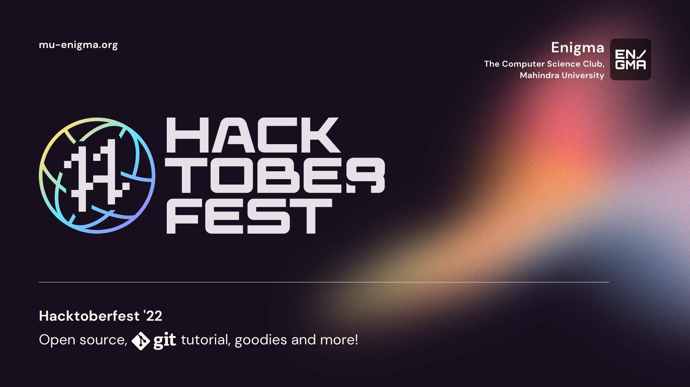
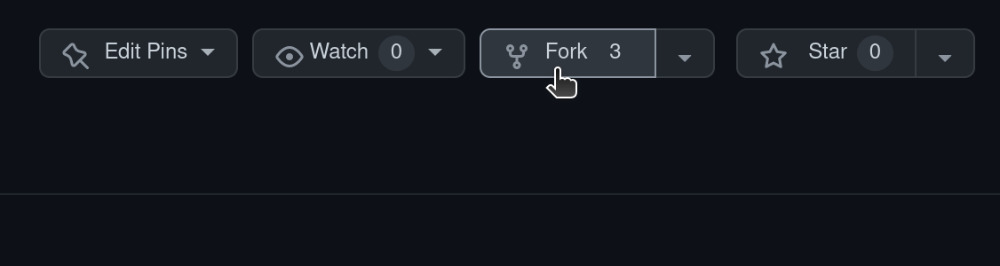
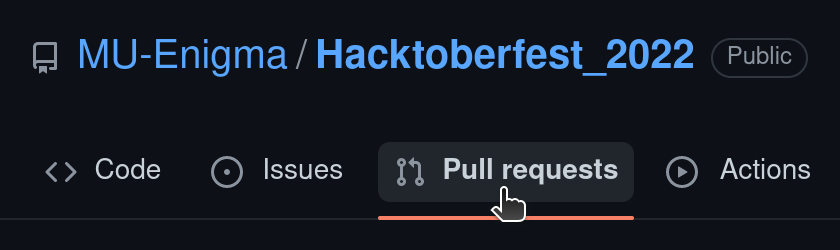

# Hacktoberfest22

## Resources
The presentation for our introductory session on Git, Github and Hacktoberfest22 is as follows:
[Hacktoberfest22 session presentation](assets/sessionPres.pdf)
 

## Content
1. [Problem Types](#problem-types)
2. [How to Contribute](#how-to-contribute)
 

## Problem Types

### Type 1
- No Code
- Competition to design logo for 0_Day (CyberSecurity workshop), Shader(Gamedev community) and Lamp(Webdev community)

### Type 2
- Low/Medium Code
- Generate images using Stable Diffusion or Create a Tic-Tac-Toe game
- Or Commit to any Enigma Github repository

### Type 3
- High Code
- Programming problems with DSA questions
 

## How to Contribute
1. Fork this repo.

2. Clone the forked repo to your local envoriment.
- `git clone https://github.com/<your_username>/Hacktoberfest_2022`
- `cd Hacktoberfest_2022`
3. Add all changes you make
4. Open a Pull Request
#### Every problem must have only one Pull request. Do not club multiple solutions in a single Pull request, it will be rejected.

5. Wait for a morderator to accept you pull request.
6. Acceptance of four such pull request marks the completion of the challenge.
